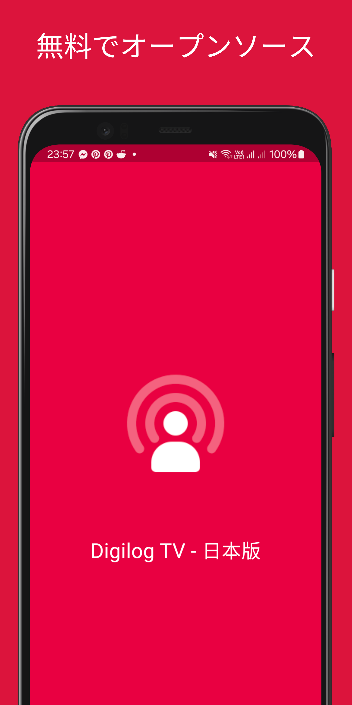
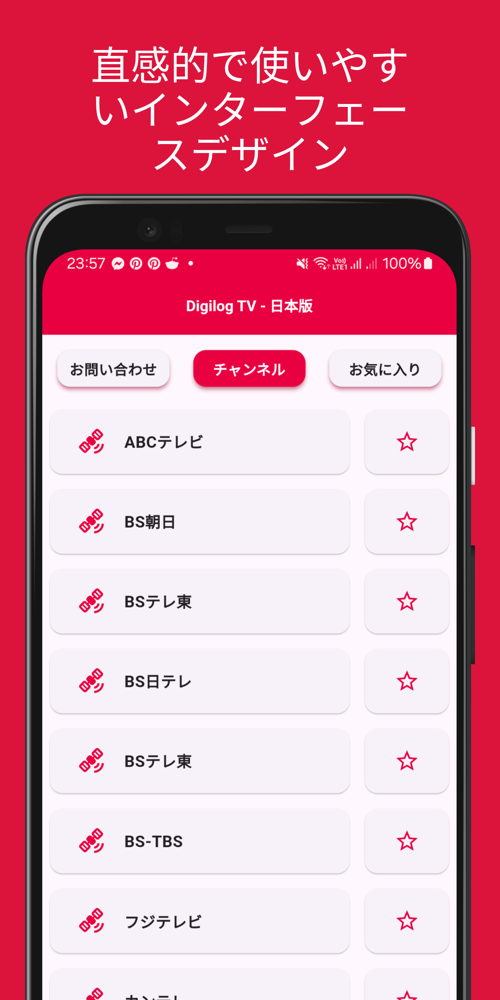
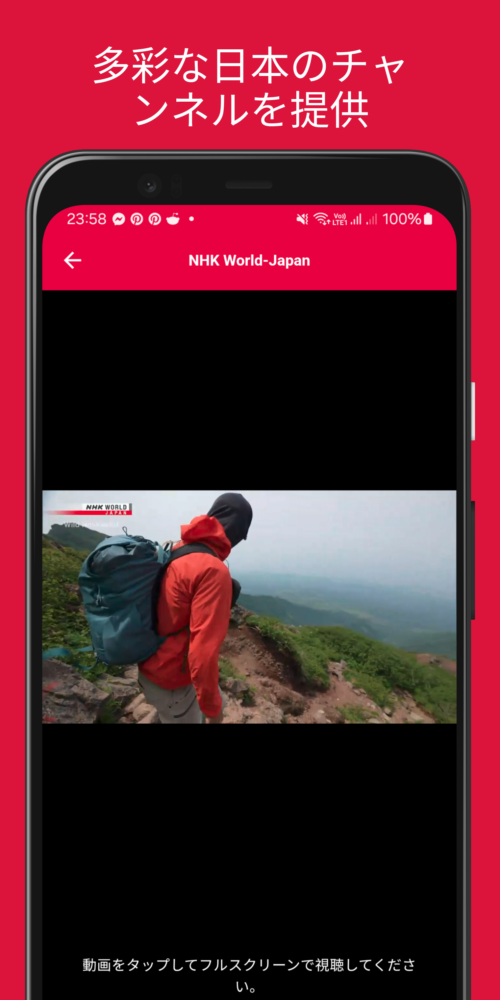

# Digilog TV - 日本版 (Digilog TV - Japanese Edition)

または、[Releases セクション](https://github.com/aldrinzigmundv/digilogtv_jp/releases/latest) から最新のAPKをダウンロードしてください

Or download the latest APK from the [Releases Section](https://github.com/aldrinzigmundv/digilogtv_jp/releases/latest)

**このアプリは aldrinzigmund.com によって提供されています**

**This app is powered by aldrinzigmund.com**

## Digilog TV - 日本版とは何ですか？

Linux Mint の Hypnotix にインスパイアされたオリジナルの Digilog TV の日本版である、無料でオープンソースのテレビアプリです。

このアプリには、Hypnotix と同様に、GitHub から Free-TV/IPTV をソースとした日本のチャンネルが含まれており、無料で合法かつ公に利用可能なコンテンツのみを提供しています。

チャンネルの提案については、Free-TV/IPTV と私たちの GitHub レポジトリの両方にイシューを登録してください。提案されたニュースチャンネルが私たちの基準を満たしている場合、Free-TV/IPTV にリストされ次第、アプリに追加します。

## What is Digilog TV - Japanese Edition?

A free and open-source TV app, Japanese Edition of the original Digilog TV which was inspired by Linux Mint's Hypnotix.

The app features Japanese channels sourced from Free-TV/IPTV on GitHub, just like Hypnotix, to ensure that it only includes free, legal and publicly available content.

For channel suggestions, please file an issue on both Free-TV/IPTV and our GitHub repo. I'll include suggested news channels that meet our criteria as soon as Free-TV/IPTV adds them to their list.

## 特徴
* 無料でオープンソース
* 直感的で使いやすいインターフェースデザイン
* 多彩な日本のチャンネルを提供
* お気に入りチャンネルに素早くアクセスできる便利なリスト
* 無料で合法かつ公に利用可能なコンテンツのみを収録

## Features
* Free and open-source
* Intuitive and easy-to-navigate interface design
* Offers a diverse selection of Japanese channels
* Convenient favorites list for quick access to your preferred channels
* Includes only free, legal, and publicly available content

## このアプリの維持をサポートするためにXMRを寄付してください

このアプリをサポートするためにXMRを寄付してください

86cQoPfKTJ2bRfGH5Ts2kzaXCRcVRiX8CUHKc9xmeUmQ8YM8Uzk9S97T5gQaqYu58C9wuFK7opDH7cM9EJyR4V5LAq9RGv4

## Donate XMR to Support Maintaining this App

Donate XMR to Support this App

86cQoPfKTJ2bRfGH5Ts2kzaXCRcVRiX8CUHKc9xmeUmQ8YM8Uzk9S97T5gQaqYu58C9wuFK7opDH7cM9EJyR4V5LAq9RGv4